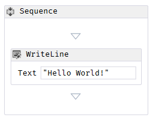

[](https://uipath.visualstudio.com/CoreWF/_build/latest?definitionId=2249&repoName=UiPath%2FCoreWF)
[](https://uipath.visualstudio.com/Public.Feeds/_packaging?_a=package&feed=UiPath-Internal&view=versions&package=UiPath.Workflow&protocolType=NuGet)
# CoreWF
A port of the Windows Workflow Foundation (WF) runtime to .NET 6. This project is still in the experimental phase. It is [licensed](LICENSE) under the MIT License.

__This is not an official Microsoft release of WF on .NET 6. CoreWF is a derivative work of Microsoft's copyrighted Windows Workflow Foundation.__

## WF Overview
Workflows are multi-step processes composed of activities. Activities are single-purpose elements that can be composed of other activities. Workflows have only one root activity in the same way that an XML document has only one root element. 

Developers can create workflows in code:
```csharp
var helloWorldActivity = new Sequence()
{
    Activities =
    {
        new WriteLine
        {
            Text = "Hello World!"
        }
    }
};
```

The workflow can be run with the following code:
```csharp
System.Activities.WorkflowInvoker.Invoke(helloWorldActivity);
```

The similarity of workflow/activity concepts to XML's document/element concepts means it's possible to write workflows in XML; specifically, an extension of XML called [XAML](https://docs.microsoft.com/dotnet/desktop-wpf/fundamentals/xaml). The "Hello World!" workflow from above can be written as:
```xml
<Activity 
 x:Class="WorkflowConsoleApplication1.HelloWorld"
 xmlns="http://schemas.microsoft.com/netfx/2009/xaml/activities"
 xmlns:x="http://schemas.microsoft.com/winfx/2006/xaml">
  <Sequence>
    <WriteLine Text="Hello World!" />
  </Sequence>
</Activity>
```

The XAML workflow can be loaded in CoreWF through [ActivityXamlServices](https://docs.microsoft.com/dotnet/api/system.activities.xamlintegration.activityxamlservices):
```csharp
var helloWorldActivity = ActivityXamlServices.Load(new StringReader(xamlString));
System.Activities.WorkflowInvoker.Invoke(helloWorldActivity);
```

WF in the .NET Framework includes a visual, drag-and-drop designer for workflows that produces XAML. The "Hello World!" workflow looks like this in the designer:



The designer experience is not part of CoreWF but the XAML produced by the designer can be run in CoreWF (with some limitations). The WF designer experience is available in Visual Studio 2019 by enabling the "Windows Workflow Foundation" individual component in the Visual Studio Installer.

## Target Frameworks
CoreWF targets .NET 6 and .NET 6 Windows. The .NET Windows target uses the **System.Xaml** included in the .NET Desktop Runtime. To use CoreWF on non-Windows runtimes, use the portable .NET 6 target. This is possible because CoreWF includes a copy of the **System.Xaml** code.

## Usage
To add this library to your project, use the [MyGet package](https://www.myget.org/feed/uipath-dev/package/nuget/UiPath.Workflow).

## Debug using Source Link

[Preview builds setup](https://docs.microsoft.com/en-us/azure/devops/pipelines/artifacts/symbols?view=azure-devops#set-up-visual-studio).

## Contributing
Check out the [contributing guide](CONTRIBUTING.md) for information on how to help CoreWF.

## Code of Conduct
This project has adopted the code of conduct defined by the Contributor Covenant to clarify expected behavior in our community.
For more information see the [.NET Foundation Code of Conduct](https://dotnetfoundation.org/code-of-conduct).

## .NET Foundation
This project is supported by the [.NET Foundation](https://dotnetfoundation.org).
